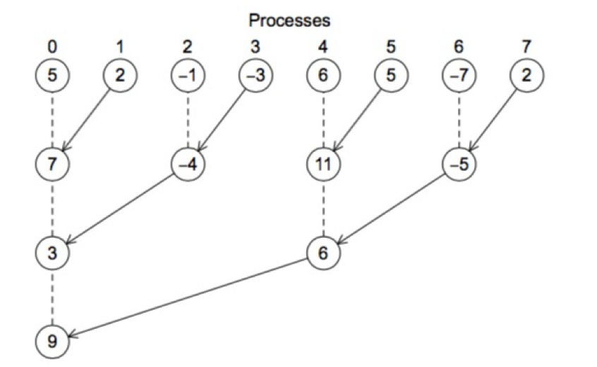

# MPI Program Structure and Basics

## Communicator
- A communicator is a collection of processes that can send messages to each other.
- **Size**: Number of processes it collects.
- **Rank**: Unique identifier in [0, size) for each process.

For example, `MPI_COMM_WORLD` :
- A predefined communicator.
- Collects every process launched with the program.

## MPI Basic Functions
### `MPI_Init`
- Usage: `int MPI_Init(int* argc_p, char*** argv_p)`
- The arguments, `argc_p` and `argv_p` are pointers to the arguments of main, `argc` and `argv` (we can pass `nullptr`).
- Tells the MPI system to do all the necessary setup.
- No other MPI functions should be called before the program calls `MPI_Init`.

### `MPI_Finalize`
- Usage: `int MPI_Finalize(void)`
- Tells the MPI system that we’re done using MPI, and that any resources allocated for MPI can be freed.
- No MPI functions should be called after the call to `MPI_Finalize`.

### `MPI_Comm_size`
- Usage: `MPI_Comm_size(MPI_Comm comm, int *size)`
  - Returns the number of processes in the communicator (`*size`).
  - **First argument**: Communicator of type `MPI_Comm`.

### `MPI_Comm_rank`
- Usage: `MPI_Comm_rank(MPI_Comm comm, int *rank)`
  - Returns the rank of the calling process in the communicator (`*rank`).
  - **First argument**: Communicator of type `MPI_Comm`.

### "Hello World" Example with MPI

```cpp
#include <cstdio>  // For printf
#include <mpi.h>   // For MPI functions

int main (int argc, char *argv[]) {
    // Initialize the MPI environment
    MPI_Init(&argc, &argv);

    int rank, size;

    // Get the total number of processes in the communicator
    MPI_Comm_size(MPI_COMM_WORLD, &size);

    // Get the rank (ID) of the current process in the communicator
    MPI_Comm_rank(MPI_COMM_WORLD, &rank);

    // Print a message from each process
    printf("Hello from process %d of %d\n", rank, size);

    // Finalize the MPI environment
    MPI_Finalize();

    return 0;
}
```

**Compiling and running the "Hello World" Program :**

*First*, to compile the MPI "Hello World" program, go to the correct directory and use the following command:

```bash
mpicxx --std=c++23 -o helloMPI hello.cpp
```
- **mpicxx**: The MPI C++ compiler wrapper.
- **-o helloMPI**: Specifies the output executable file name (`helloMPI`).
- **hello.cpp**: The source file containing the "Hello World" code. Replace this with your actual filename if it's different.

*Then*, to run the MPI "Hello World" program, use the following command:

```bash
mpiexec -np 2 ./helloMPI
```
- **mpiexec**: Launches the MPI program.
- **-np 2**: Specifies the number of processes to use (4 in this example).
- (**-oversubscribe**: if too much processes have been already used).
- **./helloMPI**: The name of the compiled executable file.

---

## Other MPI Functions : `MPI_Send` and `MPI_Recv`
### `MPI_Send`
- Usage: `int MPI_Send(const void *buf, int count, MPI_Datatype datatype, int dest, int tag, MPI_Comm comm)`
- Example: `MPI_Send(&message[0], max_string, MPI_CHAR, 0, 0, MPI_COMM_WORLD)`
- Explanation:
  - The first 3 arguments `buf`, `count`, and `datatype` determine the contents of the messsage ;
  - The remaining arguments `dest`, `tag`, and `comm` determine the destination of the message.

### `MPI_Recv`
- Usage: `int MPI_Recv(void *buf, int count, MPI_Datatype datatype, int source, int tag, MPI_Comm comm, MPI_Status *status)`
- Example: `MPI_Recv(&message[0], max_string, MPI_CHAR, r, 0, MPI_COMM_WORLD, MPI_STATUS_IGNORE)`

For both `MPI_Send` and `MPI_Recv`, here are the explanations related to the arguments: 
- `buf`: array storing the data to send or to receive;
- `count`: states how many replicas of the data type will be sent, or the maximum allowed;
- `source`/`dest`: **ranks** identifying the targer sender or the receiver;
- `tag`: nonnegative `int` used to distinguish messages traveling on the same connection (we won't use it in the APC course) *that are otherwise identical*.
    - For example: if "process 1" is sending `floats` to "process 0" but some of them should be printed and the others should be used in a computation : "process 1" can use, say, a `tag` of 0 for the messages that should be printed and a `tag` of 1 for the messages that should be used in a computation.
- `status`: detailed information on received data. *We won't use it, so we will mainly pass* `MPI_STATUS_IGNBORE`.

MPI Datatypes are the following :
- `MPI_CHAR`;
- `MPI_SHORT`;
- `MPI_INT`;
- `MPI_LONG`;
- `MPI_UNSIGNED_CHAR`;
- `MPI_UNSIGNED_SHORT`;
- `MPI_UNSIGNED_CHAR`;
- `MPI_UNSIGNED_LONG`;
- `MPI_FLOAT`;
- `MPI_DOUBLE`;
- `MPI_LONG_DOUBLE`;
- `MPI_BYTE`.
- **WARNING:** No "`MPI_STRING`" !

---

## Message matching, or how a message sent by q can be received by r :
- In process q: `MPI_Send(send_buf, send_count, send_datatype, dest, send_tag, send_comm)` ;
- In process r: `MPI_Recv(recv_buf, recv_count, recv_datatype, src, recv_tag, recv_comm, &status)` ;
- **The message sent by q can be received by r if:**
  - `send_comm = recv_comm` ;
  - `dest = r` ;
  - `src = q` ;
  - `recv_tag = send_tag` ;
  - `recv_datatype = send_datatype` ;
  - `recv_count >= send_count`.
- **Non-overtaking message:** if process q send two messages to process r, then the first message sent by q must be available to r before the second message.
  - There is no such restriction on the arrival of messages sent from different processes.
 
## Deadlocks in MPI :
- **Deadlocks** occur when processes block for communication, but their requests remain unmatched or otherwise unprocessed.
  - Example: in the same time process 0 `MPI_Send(n)` and process n `MPI_Send(0)` ; and after, once again in the same time, process 0 `MPI_Recv(n)` and process n `MPI_Recv(0)`.
- To prevent deadlocks : *smartly rearrange communications* ! (or use non-blocking calls but we won't use them in APC course).

## Process hang :
- If a process tries to *receive* a message and there is **no matching send**, then the process will **block forever**.
- When you code, be sure that every *receive* has a matching *send*.
- Be careful to inadvertent mistakes in calls to `MPI_Send` and `MPI_Recv` :
  - If tags don't match : the *receive* won't match the *send* ;
  - If the rank of the destination process is the same as the rank of the source process : the *receive* won't match the *send*.
  - Either the process will **hang**, or the receive may match another send.
 
## Quadrature Function Implementation Example with MPI :
We want to build a program which computes the quadrature of a function f(x) over a specified interval [a, b] using the trapezoidal rule.
We want to divide the intermediate computations of trapezoid areas into different cores, and at the end we *need to aggregate the computations of these areas*.

**Basic Idea:**
- Split the interval [a, b] up into `comm_sz` subintervals ;
- If `comm_sz` evenly divides n the *number of trapezoids*, we can simply apply the trapezoidal rule with n / `comm_sz` trapezoids to *each* of the `comm_sz` subintervals ;
- At the end, process 0 adds all the estimates.

**To test the DEMO on trapezoidal rule:**
- cd inside the folder ;
- mpicxx -o reduce --std=c++11 with_io.cc quadrature.cc bcast.cc reduce.cc [COMPILE] (creates an output executable file named "reduce") ;
- mpiexec -np 4 -oversubscribe reduce ;
- Enter lower bound / upper bound / number of trapezoids.

---

## MPI B :

### Collective Communication : *Or how to throw flyers from a plane*

- `MPI_Send` and `MPI_Recv` are for "one-to-one" communication ;
- Instead if send many one-to-one communications, one single  `broadcast` is more *network efficient*.
- Let's discover **collective routines**.

### Collective routines :
- Involve all the processes in a communicator ;
- Only transmit predefined MPI data types ;
- Cannot use tgas to identify messages ;
- **Warning!** Be sure that every process in the communicator calls the **same** collective function to avoid deadlocks.

### `Broadcast` :
- Usage: `int MPI_Bcast(void *buffer, int count, MPI_Datatype datatype, int root, MPI_Comm comm)`
  - Delivers an exact copy of the data in `buffer` from `root` to all the processes in `comm` ;
  - Simple example :
    | Rank | `buffer` Before | `buffer` After |
    |--------|------|--------|
    | 0 | A | A |
    | 1 | ? | A |
    | 2 | ? | A |
    | 3 |? |A |
  - Example with the trapezoidal quadrature, with broadcasting inputs :
    ```cpp
      #include <iostream>
      #include <mpi.h>
      #include "input.hh"
      
      namespace mpi // Namespace to encapsulate MPI-related functions
      {
        // Function to get input values and broadcast them to all processes
        void get_input (double & a, double & b, unsigned & n)
        {
          int rank; // Variable to store the rank of the current process
          MPI_Comm_rank (MPI_COMM_WORLD, &rank); // Get the rank of the current process

          // If the current process is the root (rank 0), read input values from stdin
          if (rank == 0) std::cin >> a >> b >> n;

          // Broadcast the values to all processes in the communicator
          MPI_Bcast (&a, 1, MPI_DOUBLE, 0, MPI_COMM_WORLD);
          MPI_Bcast (&b, 1, MPI_DOUBLE, 0, MPI_COMM_WORLD);
          MPI_Bcast (&n, 1, MPI_UNSIGNED, 0, MPI_COMM_WORLD);
        }
      }  
    ```
  - To compile with P2P : `mpicxx -o reduce --std=c++23 with_io.cc quadrature.cc p2p_input.cc p2p_output.cc` ;
  - To compile with Broadcast : `mpicxx -o reduce --std=c++23 with_io.cc quadrature.cc bcast.cc p2p_output.cc`.
  - **Warning!** We are not computing the "global sum" efficiently : in the end we don't want to send everything to one single process that has to compute the sum alone...
    - Instead we want to *split the final sum work* : this is what `MPI_Reduce` does ! cf the following picture.
    

### `MPI_Reduce` :
- Usage: `int MPI_Reduce(const void  *sendbuf, void *recvbuf, int count, MPI_Datatype datatype, MPI_Op op, int dest, MPI_Comm comm)` ;
  - Applies `op` to portions of data in `sendbuf` from all the processes in `comm`, storing the result in `recvbuf` on `dest` ;
  - Simple example :
    ```cpp
    double local_partial; // Some partial sum
    double total;
    // Perform reduction to sum up partial values
    MPI_Reduce(&local_partial, &total, 1, MPI_DOUBLE, MPI_SUM, 0, MPI_COMM_WORLD);
    ```
  - What it does in a simple example :
    | Rank | `local_partial` | `total` |
    |--------|------|--------|
    | 0 | 1 | 10 |
    | 1 | 2 | N/A |
    | 2 | 3 | N/A |
    | 3 |4 |N/A |
- The `Reduce` provided operators (`MPI_Op`)  are :
  - `MPI_MAX` ;
  - `MPI_MIN` ;
  - `MPI_SUM` ;
  - `MPI_PROD` ;
  - Others that don't interest us for this course.
- Example: `mpi::sum_and_print` function demonstrates how to aggregate partial results from multiple processes and output the result in the root process. Below is the commented code:
```cpp
#include <mpi.h> // Include the MPI library

#include "sum_and_output.hh" // Custom header for function declarations

namespace mpi // Encapsulate MPI-related functions in a namespace
{
  // Function to compute the sum of partial integrals and print the result
  void sum_and_print (double local_integral, std::ostream & out,
                      double a, double b, unsigned n)
  {
    int rank; // Variable to store the rank of the current process
    MPI_Comm_rank (MPI_COMM_WORLD, &rank); // Get the rank of the current process

    double total (0.); // Initialize the total sum
    // Perform reduction to sum all local integrals and store the result in the root process
    MPI_Reduce (&local_integral, &total, 1, MPI_DOUBLE, MPI_SUM, 0, MPI_COMM_WORLD);

    // If the current process is the root (rank 0), print the results
    if (rank == 0)
      {
        out << "n = " << n << ", a = " << a << ", b = " << b
            << ", integral = " << total << std::endl;
      }
  }
}


